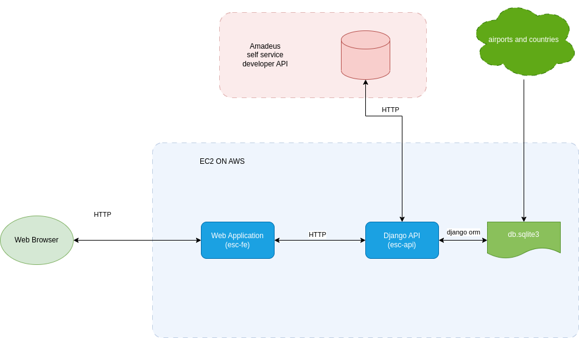

# Final project for FS React and Django  

## Assignment description

### *Create a flight ticketing app*

*Mandatory requirements*:  

* Front end with React.js
* Back end with Django
* A User should be able to search a flight and book a flight from any country to any country
* Once flight is booked, seat vacancy on the flight should be updated respectively  
* Create 'customer' and 'supplier' roles. Additional roles at your discretion
* The user "role" should effect functionality and access

*Optional*:

* Use additional libraries
* Use Redux.js
* Authentication

___

**My take** on this project was challenge myself to implement what was learned but also to Explore new areas.  
A great effort went into setting goals, research, questioning methods, searching for best practices, scrapping and re-writing.  

**The concept** is to offer the user a destination based on how far she, he or they would like to travel. once the user passes the departure location the app will present all possible destinations on an interactive Bar chart.  

## Goals

* Suggested locations are real airports - not countries.
* Real airlines
* Admin dashboard to access and modify user information.

## Challenges

* **Absence of Real Flight search APIs** - 'Google Flights', 'Sky Scanner' and other APIs are no longer available or accessible to non commercial users. Meaning I have no source for flights, ticket prices or airports.
* **Sourcing a reliable list of international airports** - The definition of what is an 'International Airport' is obscure and debatable. lists of all registered airports are easy to get but need to be filtered.
* **Airports by range** - The concept offers a feature that suggests destinations by selected range from departure.

## Solutions

* **Absence of Real Flight search APIs** - Flights and tickets are pre-populated in the database and mock data is generated on demand if no offers exist in the database.
* **Sourcing a reliable list of international airports** - A list of registered airports is filtered using cross-reference with another source using regex and pandas.
* **Airports by range** - The distance is calculated in the backend using geopy. I chose this over an external API like google.maps in order to have more control and flexibility on implementation while developing.

___

## App's tech stack

* JavaScript
* React.js
* Redux.js
* CSS
* HTML
* Django

Other libraries:

* Axios
* Material UI
* Charts.js
* GeoPy
* Pandas
* requests

___

### Project structure

```bash
./frontend
├── public
└── src
    ├── assets
    ├── components
    │   ├── account
    │   ├── booking
    │   ├── chart
    │   ├── country-card
    │   ├── flight-search-components
    │   ├── form-input
    │   ├── logo
    │   ├── nav
    │   ├── PopUpDialog
    │   ├── register
    │   ├── search-autocomplete
    │   ├── sign-in
    │   ├── sign in popup
    │   ├── slider input
    │   └── table
    ├── context
    │   ├── admin
    │   ├── airline_company
    │   ├── airlines
    │   ├── amadeus
    │   ├── auth
    │   ├── locations
    │   │   ├── airports
    │   │   └── countries
    │   ├── trip
    │   └── user
    ├── layout
    ├── pages
    ├── screens
    │   ├── admin-dashboard
    │   ├── airline-dashboard
    │   └── user-client
    ├── theme
    └── utils


./backend
├── build
│   └── static
│       ├── css
│       ├── js
│       └── media
├── core
├── flight_app
│   ├── management
│   │   └── commands
│   ├── migrations
│   ├── utils
│   │   └── db_utils
│   └── views
│       ├── admin
│       ├── auth
│       ├── flight_search
│       ├── general_views
│       ├── supplier_views
│       └── user
├── images
│   ├── algolia
│   │   ├── men
│   │   └── women
│   ├── images
│   ├── men
│   └── women
└── staticfiles
    ├── admin
    │   ├── css
    │   │   └── vendor
    │   │       └── select2
    │   ├── fonts
    │   ├── img
    │   │   └── gis
    │   └── js
    │       ├── admin
    │       └── vendor
    │           ├── jquery
    │           ├── select2
    │           │   └── i18n
    │           └── xregexp
    ├── css
    ├── js
    ├── media
    └── rest_framework
        ├── css
        ├── docs
        │   ├── css
        │   ├── img
        │   └── js
        ├── fonts
        ├── img
        └── js


```

### Diagram of the instance as deployed on AWS



### Installation and running

* clone/ copy the repo  
* `cd` to project directory
* run `source server-setup.sh && npm install`
